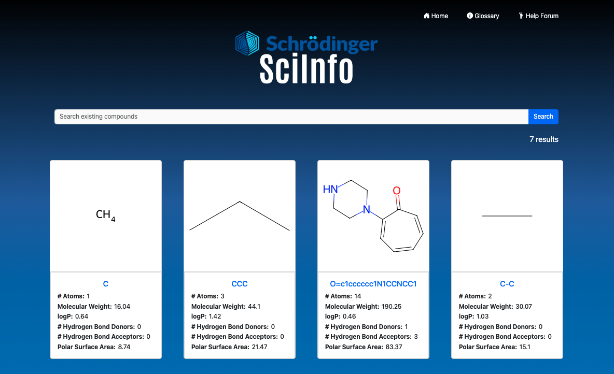

# Schrodinger SciInfo

Schrodinger SciInfo is a platform aimed at supporting [Schrodinger](https://newsite.schrodinger.com/) affiliates with non-biochemistry backgrounds to learn important discipline-specific information on the job.

 
  

    
  

 

## Features
<strong>Home Page (molecule search):</strong> Retrieve information about a compound from its SMILES representation

<strong>Key Term Glossary:</strong> Look up key biochem terms you may hear around Schrodinger

<strong>Q&A Platform:</strong> Ask and answer questions from fellow affiliates

## Key Points
<strong>Interactivity:</strong> Allows users to display non-technical information about a compound from its SMILES representation

<strong>Made for a General Audience:</strong> Maintains lay-language and includes features like a key term glossary and Q&A forum

## Future Directions
Enable search on common names of molecules as opposed to SMILES (to better meet the needs of biochem novices)

Include reference to periodic table for element characters used in SMILES

Add page/section about SMILES syntax (ex.: = → double bond, C → Carbon, etc.)

<i>SciInfo was developed during the [2024 Schrodinger Hacking the Gender Stack Hackathon](https://events.bizzabo.com/HGS2024).</i>

<strong>Created by:</strong> Michelle Cheng, Joey Cheng, Michelle Lee, Nyjur Majok, Eden Shaveet
